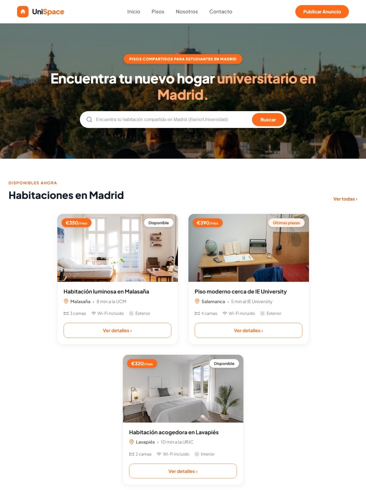

# 🏠 UniSpace - La Inmobiliaria (Grupo 3)




> **UniSpace** es una plataforma web moderna diseñada para la búsqueda y gestión de alojamiento universitario en Madrid, ofreciendo a los estudiantes de diversas universidades e institutos una experiencia intuitiva, accesible y visualmente atractiva para encontrar su nuevo hogar.

---

## Enlaces

[Enlace despliegue en Vercel](https://grupo3-la-inmobiliaria.vercel.app/)

[Tablero Kanban](https://github.com/users/wfhgdev/projects/2/views/1)

[Diseño Figma](https://www.figma.com/proto/1oazuUCZVX24yL503TKs7G/Sin-t%C3%ADtulo?node-id=0-1&t=0MktD5iCsSBx1fuz-1)


## 📌 Tabla de Contenidos

- [Descripción](#-descripción)
- [Características Principales](#-características-principales)
- [Tecnologías Utilizadas](#-tecnologías-utilizadas)
- [Estructura del Proyecto](#-estructura-del-proyecto)
- [Requisitos Previos](#-requisitos-previos)
- [Instalación y Configuración](#-instalación-y-configuración)
- [Equipo y Creadores](#-equipo-y-creadores)
- [Licencia](#-licencia)

---

## 📖 Descripción

**UniSpace** es un proyecto enfocado en solucionar la búsqueda de vivienda compartida para estudiantes en la Comunidad de Madrid. La plataforma destaca por un catálogo visual interactivo de habitaciones y pisos disponibles, información sobre agentes inmobiliarios de confianza, detalles de ubicación y servicios (Wi-Fi, estado exterior/interior, número de camas), sección gastronómica e integración con APIs externas.

---

## ✨ Características Principales

- 🔍 **Banner Principal y Búsqueda:** Buscador centralizado por barrio o universidad (UCM, IE, URJC, etc.).
- 🏠 **Catálogo de Habitaciones y Pisos:** Tarjetas interactivas con estados (`Disponible`, `Últimas plazas`), precios claros (`€/mes`), distancia a campus y características detalladas.
- 🍲 **Sección de Gastronomía (Comida):** Consulta e integración dinámica con la API externa **TheMealDB** mediante **Axios** para explorar platos típicos locales.
- 🧭 **Barra de Navegación Centrada (Header Nav):** Navegación fluida y perfectamente almidonada conectando todas las vistas de la aplicación (`Inicio`, `Habitaciones`, `Nosotros`, `Agentes`, `Comida`).
- 🤝 **Sección "Sobre UniSpace":** Reseña e historia del servicio enfocado en alojamiento universitario seguro y transparente.
- 👥 **Equipo de Agentes Inmobiliarios:** Galería visual con perfiles de agentes listos para asesorar a los estudiantes.
- 📞 **Pie de Página Completo:** Accesos directos a redes sociales (Facebook, Instagram), teléfono de contacto, dirección física en Madrid y correo de atención.
- 📱 **Diseño Totalmente Adaptativo (Responsive):** Estilos CSS optimizados para dispositivos móviles, tablets y monitores de escritorio.

---

## 🛠️ Tecnologías Utilizadas

- **Core & Framework:** [React 19](https://react.dev/)
- **Empaquetador y Servidor Dev:** [Vite](https://vitejs.dev/)
- **Enrutamiento:** [React Router DOM](https://reactrouter.com/)
- **Cliente HTTP & APIs:** [Axios](https://axios-http.com/) para conectar con la API de [TheMealDB](https://www.themealdb.com/)
- **Estilos:** Vanilla CSS3 con diseño responsivo, Flexbox y CSS Grid
- **Tipografía:** Google Fonts (*Plus Jakarta Sans*)
- **Calidad de Código y Linting:** ESLint
- **Control de Versiones:** Git & GitHub

---

## 📁 Estructura del Proyecto

```text
Grupo3LaInmobiliaria/
├── public/
│   └── favicon.svg                  # Icono del sitio web
├── src/
│   ├── assets/                      # Recursos multimedia
│   │   └── img/                     # Imágenes de inmuebles, agentes y logotipos
│   ├── components/                  # Componentes React modulares
│   │   ├── about/                   # Sección "Sobre UniSpace" (AboutComp.jsx, AboutComp.css)
│   │   ├── agents/                  # Sección de Agentes (AgentsComp.jsx, AgentsComp.css)
│   │   ├── flats/                   # Tarjetas de Habitaciones/Pisos (FlatsComp.jsx, FlatsComp.css)
│   │   ├── footer/                  # Pie de página (FooterComp.jsx, FooterComp.css)
│   │   └── header/                  # Navegación centrada y Banner (HeaderComp.jsx, HeaderComp.css, Banner.jsx)
│   ├── pages/                       # Vistas principales de las rutas
│   │   ├── about/                   # Página Nosotros (About.jsx)
│   │   ├── agents/                  # Página Agentes (Agents.jsx)
│   │   ├── flats/                   # Página Habitaciones (Flats.jsx)
│   │   ├── home/                    # Página Inicio (Home.jsx)
│   │   └── meals/                   # Página Comida integrada con Axios & TheMealDB (Meals.jsx, Meals.css)
│   ├── styles/                      # Hojas de estilo globales
│   │   ├── App.css                  # Estilos de contenedores y secciones
│   │   └── index.css                # Resets y variables de estilos base
│   ├── App.jsx                      # Configuración de rutas y layout principal
│   └── main.jsx                     # Punto de entrada de la aplicación React
├── index.html                       # Documento HTML principal
├── package.json                     # Gestión de dependencias (Axios, React Router, etc.)
├── vite.config.js                   # Configuración del entorno Vite
└── README.md                        # Documentación del proyecto
```

---

## 📋 Requisitos Previos

Asegúrate de tener instalado en tu sistema:

- [Node.js](https://nodejs.org/) (versión 18.0 o superior recomendada)
- [NPM](https://www.npmjs.com/) (incluido con Node.js)
- [Git](https://git-scm.com/)

---

## 🚀 Instalación y Configuración

Sigue estos pasos para clonar y ejecutar el proyecto localmente:

### 1. Clonar el repositorio

```bash
git clone https://github.com/wfhgdev/Grupo3-La-Inmobiliaria.git
cd Grupo3-La-Inmobiliaria
```

### 2. Instalar dependencias

```bash
npm install
npm install axios
```

### 3. Iniciar el servidor de desarrollo

```bash
npm run dev
```

Abre tu navegador e ingresa a `http://localhost:5173` (o el puerto indicado en la consola).

### 4. Compilar para producción

```bash
npm run build
```

---

## 👥 Equipo y Creadores

Proyecto desarrollado con dedicación por el **Grupo 3**:

- **Beatriz Iñiguez Cascales** – *Scrum Master y Desarrolladora* [LinkedIn](https://www.linkedin.com/in/beatriz-iniguez-cascales-dev/)
- **William Fernando Hernández Galvis** – *Desarrollador* [LinkedIn](https://www.linkedin.com/in/william-hernandez-ti/)
- **Oscar Perez** – *Desarrollador* [LinkedIn](https://www.linkedin.com/in/oscareduardoperezrodriguez/)
- **Margarita Bellido Roig** – *Desarrolladora* [GitHub](https://github.com/margaritabellidoroig)
- **Willfredy Salcedo Silvestre** – *Product Owner y Desarrolladora* [GitHub](https://github.com/Willfredy742)

---

## 📄 Licencia

Este proyecto está bajo la licencia [MIT](LICENSE).